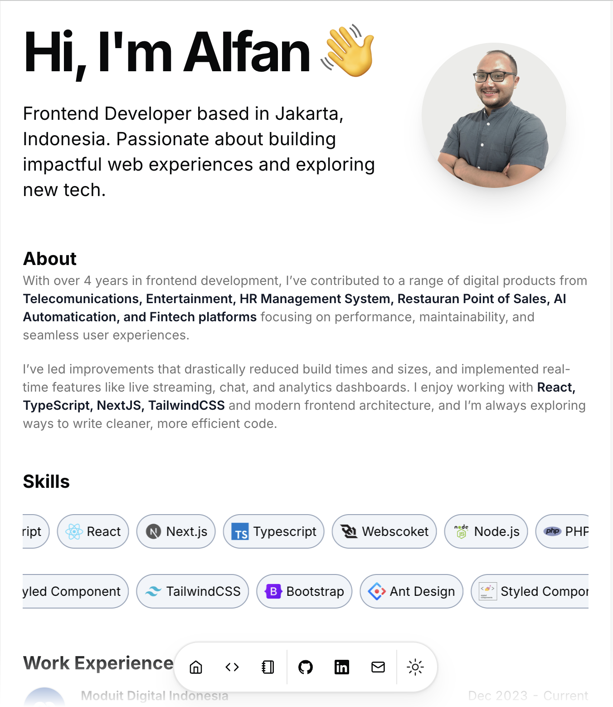

## Lighthouse Performance
<div align="center">

</div>

# Portfolio [](https://personal-web-sable-eight.vercel.app/)
Built with next.js, [shadcn/ui](https://ui.shadcn.com/), and [magic ui](https://magicui.design/), deployed on Vercel.

# Features

- Setup only takes a few minutes by editing the [single config file](./src/data/resume.tsx)
- Built using Next.js 14, React, Typescript, Shadcn/UI, TailwindCSS, Framer Motion, Magic UI
- Includes a blog
- Responsive for different devices
- Optimized for Next.js and Vercel
- Progressive Web App (PWA)

# Getting Started Locally

1. Clone this repository to your local machine:

   ```bash
   git clone https://github.com/alfan/portfolio
   ```

2. Move to the cloned directory

   ```bash
   cd portfolio
   ```

3. Install dependencies:

   ```bash
   pnpm install
   ```

4. Start the local Server:

   ```bash
   pnpm dev
   ```

5. Open the [Config file](./src/data/resume.tsx) and make changes

# License

Licensed under the [MIT license](https://github.com/dillionverma/portfolio/blob/main/LICENSE.md).
